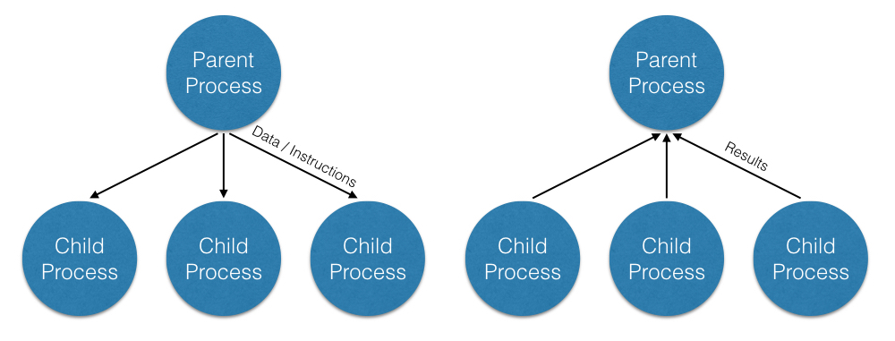

# Parallel Computing in R

This repository contains material for a workshop presented August 9, 2017.
The workshop is sponsored by Consulting for Statistics Computing and Analytics Research 
<a href='http://cscar.research.umich.edu/'>(CSCAR)</a>
at the University of Michigan. 

## Overview 
In this workshop my goal is to provide a gentle introduction to parallel computing in R.

The workshop is split into two main parts:

 + Multicore computing on a single machine using __mclapply__ from the *parallel* package.

 + Parallel computing on one or more machines using the __%dopar%__ operator from the *doParallel* package.

In addition we will discuss:

 + Options for splitting computations across multiple processes and how to choose among
these by considering both the sturcture of the tasks to be performed and the parallel architecture available. 

 + How to obtain valid and reproducible random numbers in parallel computing.  

As a word of cauation, this workshop is built around my own experience as a statistician and comes with no
guarantee of general applicability.

## Multicore computing using the **parallel** package

Most modern computers, including laptops and desktops, come with multiple processors or cores -
the distinction is not important for our purposes but see 
<a href='http://dept.stat.lsa.umich.edu/~kshedden/Courses/Stat506/computer_architecture/'>here</a>
for some discussion. The basic idea of multicore computing is to allow a single program, in this 
case R, to run multiple threads simultaneously in order to reduce the 'walltime' required for 
completion. 

In R, this can be done using the __parallel__ package distributed in the base distribution since
version 2.14.0. By default, the __parallel__ package achieves parallelism by 
<a href="https://en.wikipedia.org/wiki/Fork_(system_call)">forking</a> which is only 
available on Unix-like operating systems, i.e. Linux and Mac, but not Windows. In the image below,
we see a parent process with three forked children.  



### Multicore servers at UM
Long running computations are also commonly run on specialized, multiuser servers. For instance,
here at UM researchers have access to the Statistics & Computation Service
<a href='http://www.itcs.umich.edu/scs/'>(SCS)</a> run by ITS. You can access these servers using
`ssh` from a terminal applicaton, i.e.:

```
ssh luigi.dsc.umich.edu
```

### Using mclapply 
In R, "apply" statements iterate over a data-structure **applying** a function to each subset, i.e. 
row, column, item in list, etc., sometimes leading to efficiencies over explicit "for" loops.
The **lapply** function is used to iterate over a list and **mclapply** splits these iterations into
multiple processes.  Parallelizing sequential code with **mclapply** generally involves:

  + Loading the **parallel** package with `library(parallel)`,
  + Writing a function (or functional) to handle each case,
  + Calling `mclapply` with appropriate options.

```
library(parallel)
myFunc = function(case) {
 # ... do something with case ...
 return(case_result)
}

# when inputs to myFunc are defined relatively by case 
results = mclapply(1:nCases,myFunc)

# or

# when myList has data/parameters that are specific to each case
results = mclapply(myList,myFunc)
```

### Running Example - Gene Set Enrichment Analysis

As a running example, we will consider permutation tests for gene set enrichment analysis.
Such analyses are used to understand large-scale sequencing experiments in terms of sets of functionally
related and possibly differentially expressed genes. For data we will use a cohort of Triple Negative Breast Cancers
consisting of two racial groups, African Americans (AA) and American of European ancestry (EA). 
The data originally come from
<a href='https://www.ncbi.nlm.nih.gov/geo/query/acc.cgi?acc=GSE46581'>here</a> and is named `YaleTNBC.Rdata' in this repository. 

At a high level, the basic steps of the analysis are:

 + **Gene scores**: score each gene using a univariate statistic  (we'll use the t-statistic),
 + **Set scores**: compose the statistics for all genes in a set (we will sum them),
 + **Inference**: build up a null reference distribution by repeatly permuting the group labels and
   recomputing gene and set scores for each permutation.

In <a href='./Example0.R'>Example 0</a> we examine sequential and parallel implementations for 
computing the genescores. 
  
### Do you need to parallelize? 
When thinking of parallelizing some portion of a program it is important to remember that 
parallelism is not magic. There is some computational overhead involved in splitting the task, 
initializing child processes, communicating data, and coallating results.  For this reason, there
is usually little to be gained in parallelizing already fast computations (less than a second) as
the overhead may outweigh the increase in time.  

At the same time, the maximum impact of parallelism is generally the sequential walltime divided
by the number of cores available and, in many cases, the actual impact will be even less.
As such, very long running programs may need require reconcieving the algorithm, implentation, or purpose in
order to be computationally feasible even with parallelism.

An exception to this idea of linear improvement in runtime with the number of available cores can occur when
the overall runtime is dominated by rare but long running sub-processes. In these cases, well designed parallelism
can lead to substantial improvement by repeatedly re-using cores not occupied by the long-running sub-process.

## Parallel computing with doParallel and foreach

## Random numbers and parallel computing

Many statistical and machine learning applications rely on pseudo-random numbers for things like  
sampling from distributions and stochastic optimization. When child processes are spawned to compute
in parallel, care needs to be taken to ensure random number streams behave as expected. This is particulary true
for bootstrap inference, Monte Carlo simulations, and other applications where it is important that 
iterations are independent.  Care is also needed to ensure results can be reliably reproduced using `set.seed()`.

As seen in <a href='./Example1.R'>Example 1<\a> this can be acheived in the multicore approach typifed by calls
to __mclapply__ by instructing R to use "L'Ecuyer-CMRG" for random number generation by calling `RNGkind("L'Ecuyer-CMRG")`.

In the `foreach` approach this can be handled by using the **doRNG** library and replacing `%dopar%` calls with `%dorng%`.

For more details, see the doRNG <a href='https://cran.r-project.org/web/packages/doRNG/vignettes/doRNG.pdf'>vignette</a>.

